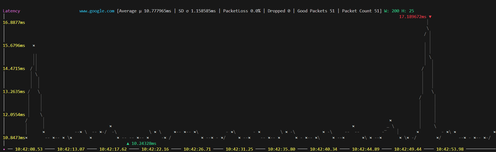
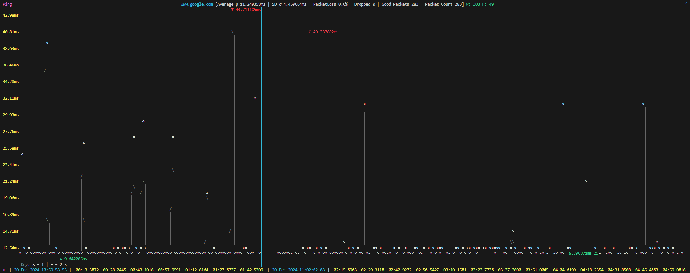
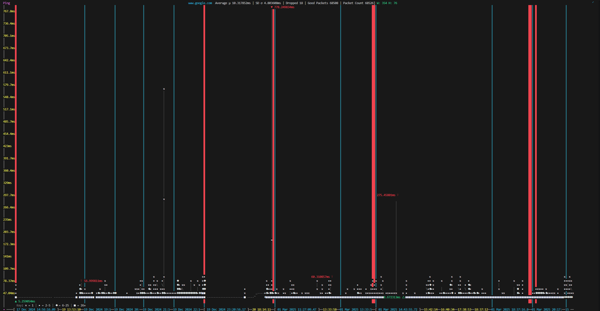

# AcciPing

AcciPing an in terminal ping CLI utility.



This is still a WIP ⚠️ And may panic for no reason.

### Span Show case

Single span:

Multi-day recording (40,000 packets being shown):


## Setup

This binary relies on [golang.org/x/net/icmp](https://pkg.go.dev/golang.org/x/net/icmp) and the stdlib `net`
in order to open **raw sockets** and communicate directly in the "echo" format. Since this protocol relies on
reading all traffic coming into the computer it is a security risk to allow any binary to do this
communication without being granted explicitly higher permissions. Hence to run this program you may need to
follow the OS specific guidance in order to allow this program to run:

## Windows

TODO

## Mac

TODO

## Linux
On linux to ensure that you do not get prompted for root permissions to execute the binary, simply run this
command to allow IPv4 sockets to be opened by un-privileged binaries.

```sh
sudo sysctl -w net.ipv4.ping_group_range="0 2147483647"
```