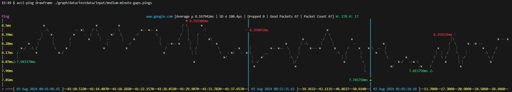

# acci-ping

`acci-ping` is an in terminal ping CLI utility.

[]()

## Documentation

`acci-ping` can run be with no arguments to start the graphing ping accumulator. To exit simply kill the
program via the normal control-c.

### Arguments

* `-file [file]`
        the file to write the pings into. (default data not saved)
* `-hide-help`
        if this flag is used the help box will be hidden by default
* `-pings-per-minute float`
        sets the speed at which the program will try to get new ping results, 0 represents no limit. Negative values are an error. (default 60)
* `-url [url]`
        the url to target for ping testing (default `www.google.com`)


<details>
<summary><b>🐛 Debug Arguments</b></summary>

* `-l [file]`
        write logs to file. (default no logs written)
* `-debug-error-creator`
        binds the [e] key to create errors for GUI verification
* `-cpuprofile [file]`
        write cpu profile to file
* `-memprofile [file]`
        write memory profile to file

</details>

## Sub commands

`acci-ping` comes with some extra subcommands for help with the `.pings` file type. Since `.pings` is a binary
serialisation format to keep file sizes low (70,000 packets only requires 33~ bytes on average to store which
is over half compared to CSV) as well as storing some extra meta data.

* `acci-ping drawframe [file|folder]` will draw a single frame of the graph for a given `.pings` file, e.g you
  can use the test data in this repo to give it a try:
 
* `acci-ping rawdata [file] [file...]` will print the statistics and all raw packets found in a `.pings` file
  to stdout.
  ```sh
  $ acci-ping rawdata ./graph/data/testdata/input/medium-minute-gaps.pings
  BEGIN www.google.com: 03 Aug 2024 00:41:06.65 -> 01:02:28.1 (21m21.449886808s) | Average μ 8.167942ms | SD σ 80.4µs | Packet Count 67
  0: 216.58.201.100 | 2024-08-03T00:41:06.657+01:00 | 7.943379ms
  1: 216.58.201.100 | 2024-08-03T00:41:07.658+01:00 | 8.154265ms
  2: 216.58.201.100 | 2024-08-03T00:41:08.657+01:00 | 8.194011ms
  ...
  64: 172.217.16.228 | 2024-08-03T01:02:26.106+01:00 | 7.949701ms
  65: 172.217.16.228 | 2024-08-03T01:02:27.106+01:00 | 8.274327ms
  66: 172.217.16.228 | 2024-08-03T01:02:28.106+01:00 | 8.278227ms
  END www.google.com: 03 Aug 2024 00:41:06.65 -> 01:02:28.1 (21m21.449886808s) | Average μ 8.167942ms | SD σ 80.4µs | Packet Count 67
  ```
* `acci-ping ping` will run like any other ping command line tool and print the plain text packet statistics to
  stdout.
  ```
  $ acci-ping ping
  Pinging to "www.google.com" (4 times) at "142.250.179.228"
  142.250.179.228 | 2025-03-15T15:32:38.671980225Z | 8.689457ms
  142.250.179.228 | 2025-03-15T15:32:40.005615532Z | 8.874891ms
  142.250.179.228 | 2025-03-15T15:32:41.337992341Z | 8.831399ms
  142.250.179.228 | 2025-03-15T15:32:42.671321452Z | 8.817724ms
  ```

All of these sub commands have their specific command line flags which can be shown with `-h` or `-help`.

## Installation

TODO

<details>
<summary><b>🪟 Windows</b></summary>

TODO Windows
</details>

<details>
<summary><b>🍎 Mac/Apple</b></summary>

TODO Apple
</details>


<details>
<summary><b>🐧 Linux</b></summary>

On linux to ensure that you do not get prompted for root permissions to execute the binary, simply run this
command to allow IPv4 sockets to be opened by un-privileged binaries.

```sh
sudo sysctl -w net.ipv4.ping_group_range="0 2147483647"
```
</details>


## About

This binary relies on [golang.org/x/net/icmp](https://pkg.go.dev/golang.org/x/net/icmp) and the stdlib `net`
in order to open **raw sockets** and communicate directly in the
"[echo](https://en.wikipedia.org/wiki/Internet_Control_Message_Protocol)" format. Since this protocol relies
on reading all traffic coming into the computer it is a security risk to allow any binary to do this
communication without being granted explicitly higher permissions. Hence to run this program you may need to
follow the OS specific guidance in order to allow this program to run.

This package is also a "no third party" dependency project where other than the go standard library (and `/x/`
packages) no other dependencies are used, this is more for the challenge than any other reason. And there's an
exception for unit tests as I plan to try some rapid-quick check tests in future.

